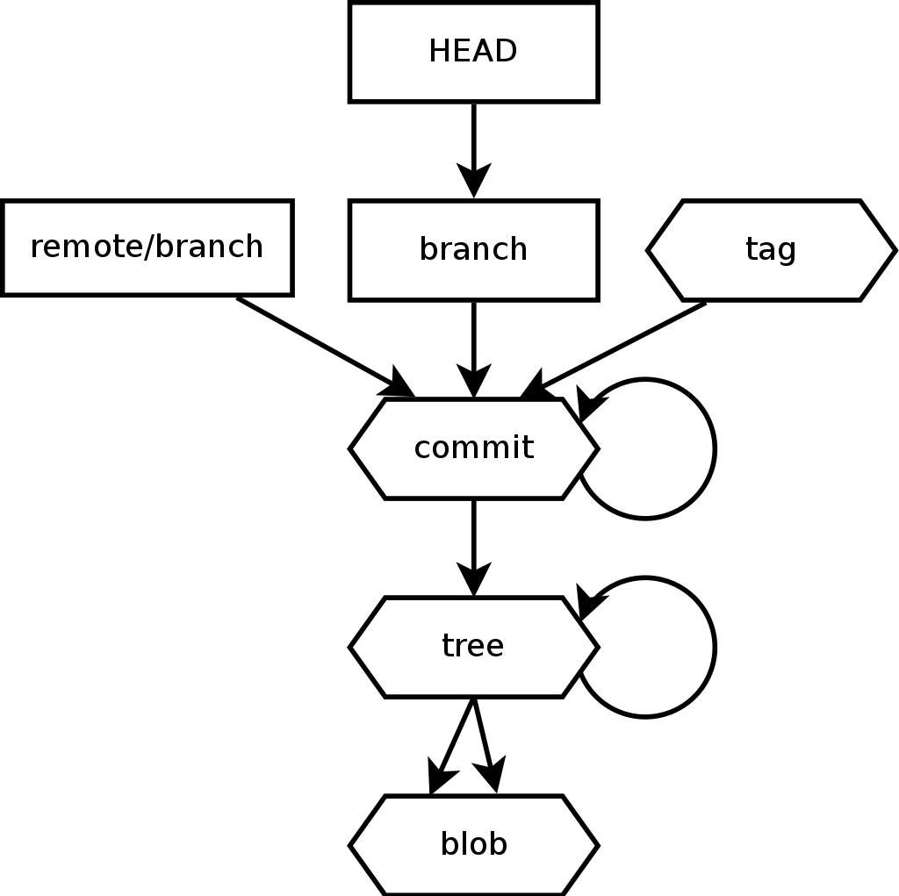
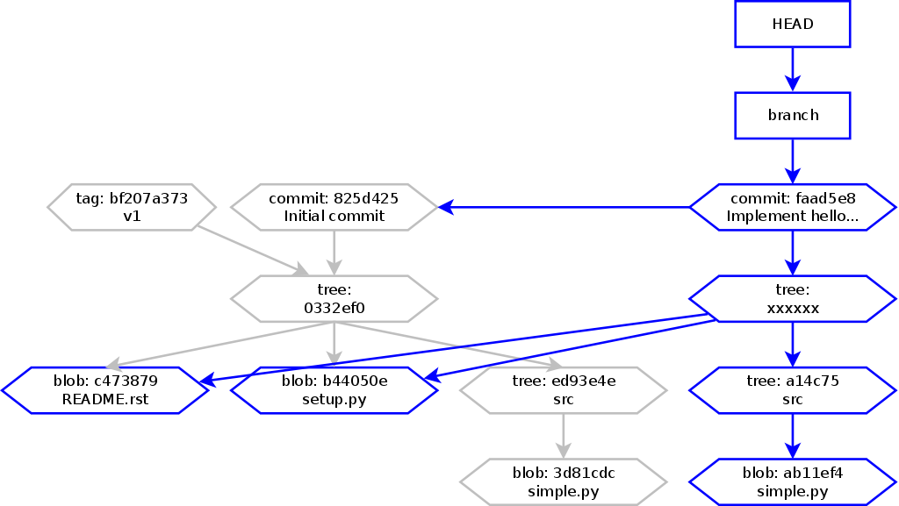

# Comprendre Git

## Les types d'objets de Git

Les objets Git sont les données de Git, il y a 4 type d'objets principaux
**Blob**, **Tree**, **Commit**, **Tag**.

Les objets sont stockés dans le répertoire Git qui se trouve généralement à la
racine du projet ``.git/objects/``.

Prenons un exemple simple de librairie python:

```
.
├── README.rst
├── setup.py
└── src
    └── simple.py
```

### Blob

Les Blobs sont les contenu des fichiers.

```
.                       │ 
├── README.rst          │   blob: c473879
├── setup.py            │   blob: b44050e 
└── src                 │
    └── simple.py       │   blob: 3d81cdc

```

explorons les blobs:

```bash
$ git cat-file -t c473879
blob
$ git cat-file -p c473879
=======================
Simple librairie python
=======================

Ceci est une fausse librairie pour montrer le
fonctionnement interne de git.
```

> **Important**: noté bien que seulement le contenu des fichier est stocké et
> non le fichier, les noms et modes du fichiers sont stockés dans les objets
> de type **Tree**


### Tree

Les répertoires correspondent aux **trees**.

```
.                       │   tree: 0332ef0
├── README.rst          │   blob: c473879
├── setup.py            │   blob: b44050e 
└── src                 │   tree: ed93e4e
    └── simple.py       │   blob: 3d81cdc
```

Le contenu d'un objet de type **tree** est une liste d'objets **trees** ou
**blobs** avec chaque entrée le *mode*, le *type*, le *sha* et le *nom*:

```bash
$ git cat-file -t 0332ef0
tree
$ git cat-file -p 0332ef0
100644 blob c47387    README.rst
100644 blob b44050    setup.py
040000 tree ed93e4    src
```

### Commit

Le commit permet de gérer l'historique.

```
                        │   commit: 825d425
.                       │   tree: 0332ef0
├── README.rst          │   blob: c473879
├── setup.py            │   blob: b44050e 
└── src                 │   tree: ed93e4e
    └── simple.py       │   blob: 3d81cdc
```

Un objet **commit** contient un pointeur vers un objet **tree**, un auteur,
un committer, un message et les commits parent.

```bash
$ git ls-tree 825d425
100644 blob c47387    README.rst
100644 blob b44050    setup.py
040000 tree ed93e4    src
$ git cat-file -t 825d425
commit
$ git cat-file -p 825d425
tree 0332ef0
author Pierre Verkest <pverkest@anybox.fr> 1461854704 +0200
committer Pierre Verkest <pverkest@anybox.fr> 1461854704 +0200

Initial commit
```

Comme c'était le commit initiale, il n'y a pas de commit parent, voici
ce que ça donne avec un second commit

```bash
$ git l
* faad5e8 (HEAD, master) Implement Hello the world
* 825d425 Initial commit
$ git cat-file -p faad5e8
tree 69012a
parent 825d42
author Pierre Verkest <pverkest@anybox.fr> 1461856311 +0200
committer Pierre Verkest <pverkest@anybox.fr> 1461856311 +0200

Implement Hello the world
```

> **Note**: un commit qui merge 2 branches aura 2 parents!

### Tag

L'objet de type **tag** permet de faire des raccourcis vers un commit en
particulier

```
                        │   tag: bf207a373
                        │   commit: 825d425
.                       │   tree: 0332ef0
├── README.rst          │   blob: c473879
├── setup.py            │   blob: b44050e 
└── src                 │   tree: ed93e4e
    └── simple.py       │   blob: 3d81cdc
```

Un tag contient les informations, d'objet sha vers lequel il pointe, le type
(normalement un commit), le tag lui même, la personne ayant créé le tag, un
message et il peut également contenir une signature gpg pour permettre de
valider l'intégriter d'une version ou d'une release.

```bash
$ git cat-file -t bf207a373
tag
$ git cat-file -p bf207a373
object 825d425
type commit
tag v1
tagger Pierre Verkest <pverkest@anybox.fr> 1461858515 +0200

Realease v1
```

> **Important**: Les branches (qui pointent également vers des commits) ne sont
> pas sauvegardés comme des objets.

## Les références

Nous venons de voir les objets qui ne peuvent pas être modifiés, à l'inverse
les réfénces, également enregistrées (répertoire ``.git/refs``) par git peuvent
changer constament. Ce sont de simple pointeur vers des commits, un peu comme
des tags mais plus facilement modifiable.

## Le modèle





__Schématisons l'exemple ci dessus__

Pour rappel au premier commit nous avions ajouté l'ensemble des fichiers
suivant :

```
                        │   tag: bf207a373
                        │   commit: 825d425
.                       │   tree: 0332ef0
├── README.rst          │   blob: c473879
├── setup.py            │   blob: b44050e 
└── src                 │   tree: ed93e4e
    └── simple.py       │   blob: 3d81cdc
```


Puis au second commit nous avons modifié le fichier ``simple.py`` nous arrivons
donc à l'état suivant:

```bash
$ git l
* faad5e8 (HEAD, master) Implement Hello the world
* 825d425 (tag: v1) Initial commit
```



---
Ce chapitre est très grandement inspiré de l'exellent document [Git Internals](
https://github.com/pluralsight/git-internals-pdf/releases) de [Scott Chacon](
https://github.com/schacon)
